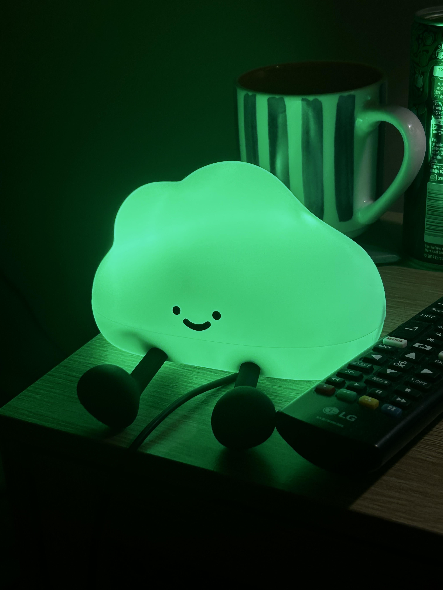
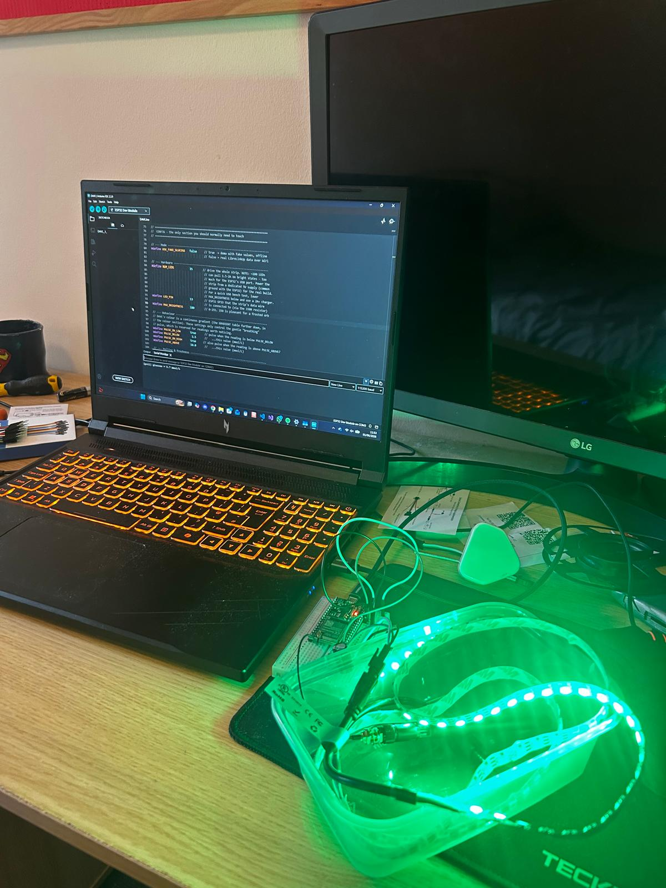
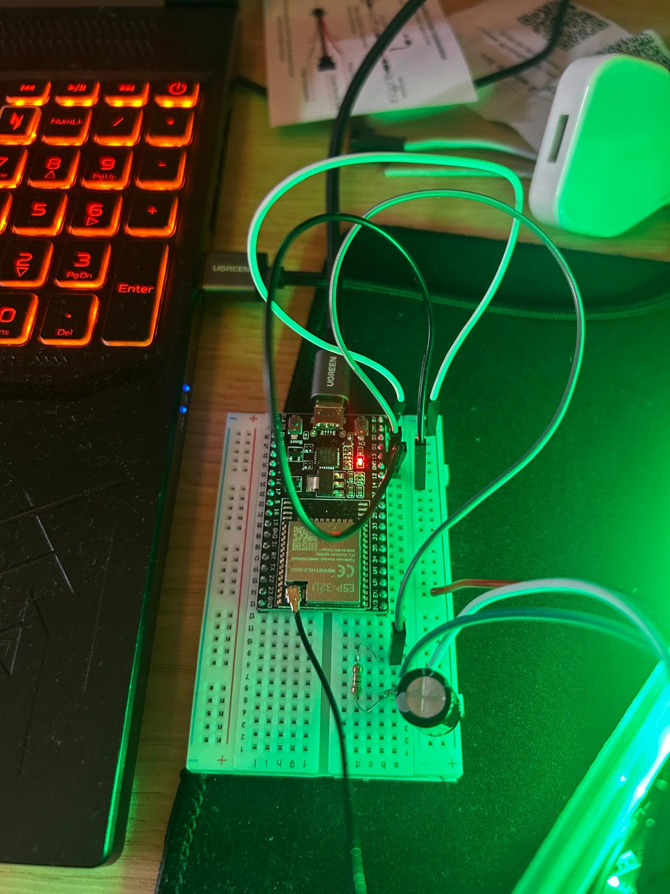
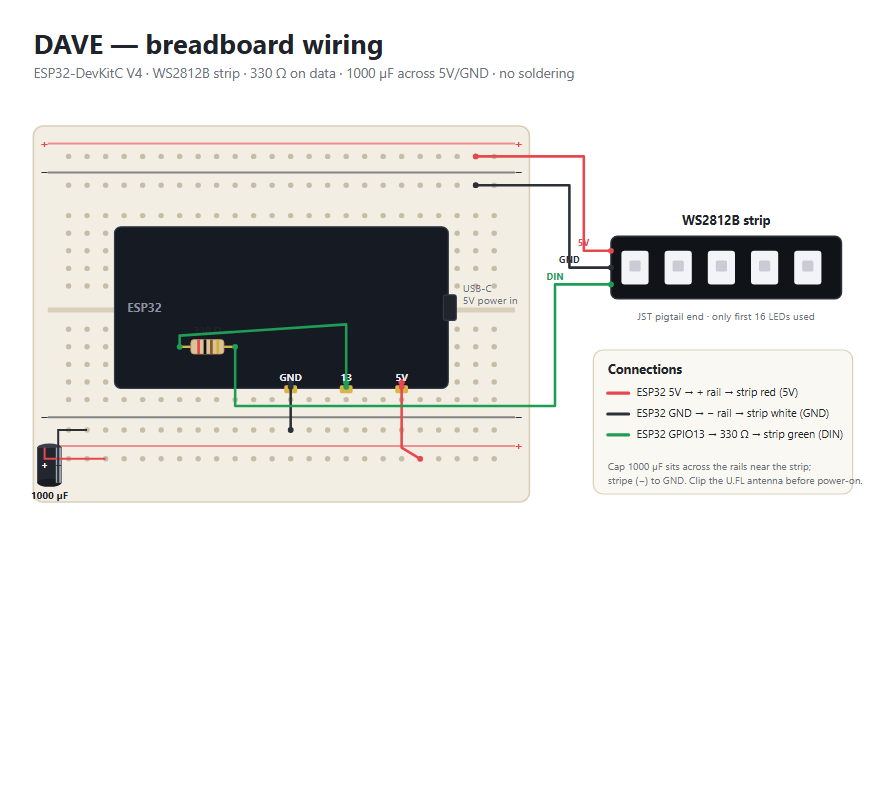

# DAVE-Light
The DAVE (Diabetes Analysis and Visulation Electronic) is an LED Light Strip that changes colour based on data from a Libre 2 Sensor by Abbott. NOTE: This software is not to be used in replacement of any system or alarms, it is simply an aid.

Below is Dave inside and outside its shell. The one outside the shell is glowing White as it is not connected to Wifi.




# DAVE — a glucose mood light

DAVE is a frosted orb that glows a different colour depending on a person's real-time
blood glucose. It's built for a type 1 diabetic on an Omnipod 5 pump with a FreeStyle
Libre 2 Plus sensor, and it's meant to be a *lovely-to-have* — a way to know her state at
a glance without picking up a controller.

> **Safety first.** DAVE is ambient, **not** a medical alarm. It lags the cloud by a few
> minutes and can silently fail (WiFi, server, power). Her Libre and Omnipod alarms remain
> the safety-critical layer. DAVE is deliberately designed to **fail visibly** — a dim
> white pulse when it can't see fresh data — rather than show a stale, falsely-reassuring
> colour.

---

## 1. How DAVE works

The data takes a fully official route, no hacks:

1. Her **Libre 2 Plus sensor** feeds readings to the **Omnipod 5 controller**.
2. The controller uploads to **Abbott's LibreView cloud** over WiFi.
3. That cloud serves the reading to **LibreLinkUp** followers (Abbott's official "follower"
   app). DAVE logs in as one of those followers.
4. An **ESP32** on your shelf polls LibreLinkUp every **60 seconds**, reads the *live*
   glucose value, and drives a small ring of **WS2812B** LEDs inside the orb.

The colour is a **continuous gradient**, not hard bands — it slides smoothly as the number
moves:

| Reading (mmol/L) | Colour | Meaning |
|---|---|---|
| ~3.8 and below | **Red** (gentle slow pulse below 3.5) | Low — grab attention |
| 4 – 8 | **Green** | In range |
| 8 – 12 | fades green → **blue** | Drifting high |
| 12 – 15+ | fades blue → **violet** | High |

Plus three non-numeric status states, each with a slow "breathing" pulse:

| State | Colour | Why |
|---|---|---|
| Stale / network error | Dim white | Can't trust the data — fail visibly |
| T&Cs need accepting | Amber | Abbott pushed new terms; open the LibreLinkUp app to clear |
| Booting | Dim teal | Just powered on, hasn't reached the cloud yet |

The sketch also ships with a **`USE_FAKE_GLUCOSE` demo mode** (on by default) that cycles
through every colour and state with no network at all — so you can build and test the whole
orb before the LibreLinkUp account is even set up.

---

## 2. Parts and cost

### 2A. Total cost

**Roughly £45–£50** for everything, buying new from Amazon UK.

In practice it's cheaper *per orb*: the resistors, capacitors, jumper wires and (often) the
ESP32 come in multipacks, so you finish with plenty of spares for the next project. A frosted
orb enclosure isn't included in this total — see the note below the table.

> Prices below are typical UK figures at time of writing, not live-scraped to the penny —
> Amazon pricing moves around and many of these are sold in variable multipacks. Treat them
> as a ballpark.

### 2B. Parts breakdown

| Part | What it's for | Notes | Approx. £ (UK) |
|---|---|---|---|
| **ESP32-DevKitC V4** (DUBEUYEW, `-U` external-antenna variant) | The brain — WiFi, polling, driving the LEDs | Get the **U.FL / external antenna** version so the orb can move around the house. Often sold in 2-packs (~£15). | ~£11 |
| **BTF-Lighting WS2812B strip**, 1m, 60 LEDs/m | The light | Ships with a JST connector + a male pigtail with bare wires — perfect for a breadboard, **no soldering**. | ~£9 |
| **400-point solderless breadboard** | Holds the circuit together, no soldering | — | ~£5 |
| **ELEGOO 120-pc jumper wire kit** (M-M, M-F, F-F) | Connections | You'll use a handful; rest are spares. | ~£7 |
| **Resistor assortment kit** | Pull one **330 Ω** for the data line | — | ~£7 |
| **1000 µF / 16V electrolytic capacitor** | Smooths power to the LED strip | Sold in packs (~15); you need one. | ~£6 |
| **USB power + cable** | Powers the ESP32 | Any phone charger ≥ 1A. A data cable usually comes with the ESP32. | ~£0–4 |
| **Frosted orb / lamp enclosure** | The body of DAVE | £10 | — I found that typing in "Night Light" on amazon works, Ive attached the ones Ive used|

All listed parts can be found here , these aren't amazon referal links so feel free to adapt to what best suits you.

ESP32 - https://www.amazon.co.uk/dp/B0D7ZGT9PM?ref=ppx_yo2ov_dt_b_fed_asin_title
Bread Board - https://www.amazon.co.uk/dp/B0CPJP9YSN?ref=ppx_yo2ov_dt_b_fed_asin_title&th=1
Resistors - https://www.amazon.co.uk/dp/B0BTP6WYH1?ref=ppx_yo2ov_dt_b_fed_asin_title&th=1
LEDS - https://www.amazon.co.uk/dp/B07JBYZRWD?ref=ppx_yo2ov_dt_b_fed_asin_title&th=1
Jumper Wires - https://www.amazon.co.uk/dp/B01EV70C78?ref=ppx_yo2ov_dt_b_fed_asin_title

Capacitors - https://www.amazon.co.uk/dp/B0F6VBL64K?ref=ppx_yo2ov_dt_b_fed_asin_title&th=1
Night Light (Body) - https://www.amazon.co.uk/Refluxe-Silicone-Dimmable-Rechargeable-Nightlight/dp/B0DMSG3Y7F/ref=sr_1_1_sspa?dib=eyJ2IjoiMSJ9.annyE769FsN7TmpQeYXZTclNgMOaYPe9lePnHHZIG6WmdvsHiUc4tOAZeALJgTh4IxPrlUQJrGExfivnx8zrYU_89rdFWGjk2a5YZbVrIxrlD2eSimfBI87ygm9WVLkn8wEA7kMN39luebaj8hkxeQQfi5IeC_ASdzNMwJeB6lzKudUyfN1PNBaTtpQftiyth760kipivabgkDfxeff9iCUSf7N_6w9hn9wOa3Ohs5JrOxb_WDjqaysnKv9L8-Ea8IrpTMZZhONF0nvUxlNM21TpxXzGug7hb3HahkouHH4.yYSS-qff1a-z3GAJhvIfcLGCCbaB7JNrxRgbAM_CGtg&dib_tag=se&keywords=cloud%2Bnight%2Blight&qid=1783186858&sr=8-1-spons&aref=ZoIyi6rVq8&sp_csd=d2lkZ2V0TmFtZT1zcF9hdGY&th=1

---

## 3. Building DAVE and uploading the code

Nothing here needs soldering. The whole build is designed around a breadboard.

### Step 1 — Clip on the antenna (do this first)

Find the small **gold square (U.FL connector)** on the ESP32-WROOM-32U module. Press the
U.FL plug onto it with a fingernail until it **clicks** — it's fiddly the first time. Then
screw the SMA antenna onto the other end of the cable.

> **No antenna = no WiFi.** Always connect it *before* powering on.

### Step 2 — Wire it up




Only three connections, plus the capacitor across the power rails:

```
ESP32  5V   ──►  capacitor +  ──►  strip RED wire (5V)
ESP32  GND  ──►  capacitor −  ──►  strip WHITE wire (GND)
ESP32  GPIO13 ──[ 330 Ω ]──►  strip GREEN wire (DIN, data in)
```

- Put the **330 Ω resistor** in series on the data line (GPIO13 → resistor → strip green).
- Put the **1000 µF capacitor** across the 5V and GND rails, close to the **strip end** of
  the power lines. **Mind the polarity** — the capacitor's marked leg (usually a stripe) is
  the negative (−) leg and goes to GND.

> **Which pin?** The sketch uses **GPIO 13** (`#define LED_PIN 13`). ESP32-DevKitC V4 boards
> label their pins on the silkscreen — double-check yours reads `13` where you're plugging in,
> and change `LED_PIN` if your board's layout differs.

> **How many LEDs / powering it.** The sketch drives the whole strip (`NUM_LEDS 100`). A full
> 100 LEDs at full brightness can pull 1.5–2 A, which is **too much for the ESP32's USB port** —
> for a bright build, power the strip from a **dedicated 5V supply sharing a common ground**
> with the ESP32. For a simple USB-only "orb on a shelf", set `NUM_LEDS` to something small
> (e.g. `16`) and/or lower `MAX_BRIGHTNESS`, and use a 2A+ charger. A frosted orb doesn't need
> many LEDs to look good.

### Step 3 — Install the tools and libraries

In the **Arduino IDE**:

1. Install ESP32 board support (Boards Manager → "esp32" by Espressif) if you haven't already.
2. Library Manager → install:
   - **Adafruit NeoPixel** (by Adafruit)
   - **ArduinoJson** (by Benoit Blanchon, **v7.x**)

   *(WiFi, HTTPClient and mbedTLS come with the ESP32 board package — nothing to install.)*

### Step 4 — Board settings

- **Tools → Board →** ESP32 Arduino → **"ESP32 Dev Module"**
- **Tools → Upload Speed →** 921600
- **Tools → Flash Size →** 4MB (32Mb)
- Other defaults are fine.

### Step 5 — Flash and watch the demo

1. Open the DAVE sketch. Leave **`USE_FAKE_GLUCOSE = true`** for now.
2. Plug the ESP32 in over USB, pick the right port under **Tools → Port**, and hit **Upload**.
3. Watch DAVE run its self-guided tour: it sweeps smoothly up the range (red → violet), shows
   the **stale** (white) and **T&Cs** (amber) states, then sweeps back down — looping forever,
   with the low-end pulse switching on and off as it passes through. Open the Serial Monitor at
   **115200 baud** to see it narrate each phase.

If that all looks right, the hardware is good.

### Step 6 — Go live on real data

Do this only once your **LibreLinkUp follower account is set up and your own phone is already
showing her live number** (that's the proof the data route works and clears the T&Cs trap):

1. In the sketch's CONFIG section, fill in your **WiFi SSID/password** and your **LibreLinkUp
   email/password** (the follower account you created).
2. Leave `LLU_REGION = "eu"` for a UK account.
3. Set **`USE_FAKE_GLUCOSE = false`** and re-upload.

DAVE will connect, log in, and start showing her live glucose as colour.

### Step 6 — Placing in the Shell / Body

Once the lights are all connected and you are happy with the system you can take out the eletectronics of the night light and replace them with the current system, ensuring a wire is hanging out for power. This step is actually quite easy if a night light like the one above is used however this step is significantly easier with 2 people as one person can stretch the silcione casing and one person can place the breadboard in as gently as possible.
---

### Troubleshooting notes

- **WiFi won't connect** → is the antenna clipped on? That's the usual culprit.
- **Logins start failing months from now** → bump `LLU_VERSION` in the sketch to match the
  current LibreLinkUp Android app version. This is almost always the fix.
- **"no connections" in the Serial log** → the follower invite hasn't been accepted, or her
  sensor isn't active/sharing yet.
- **Orb flickers or browns out on bright colours** → it's drawing too much current over USB;
  reduce `NUM_LEDS` / `MAX_BRIGHTNESS` or move to a dedicated 5V supply.

*Known limitation (by design):* the freshness check is half-wired — a **connection failure**
correctly triggers the white stale state, but a working connection serving an **old number**
won't yet. Adding proper time-based staleness (NTP + the response timestamp) is the planned
v1.1 improvement. Her real Libre alarms remain the primary safety layer regardless.
